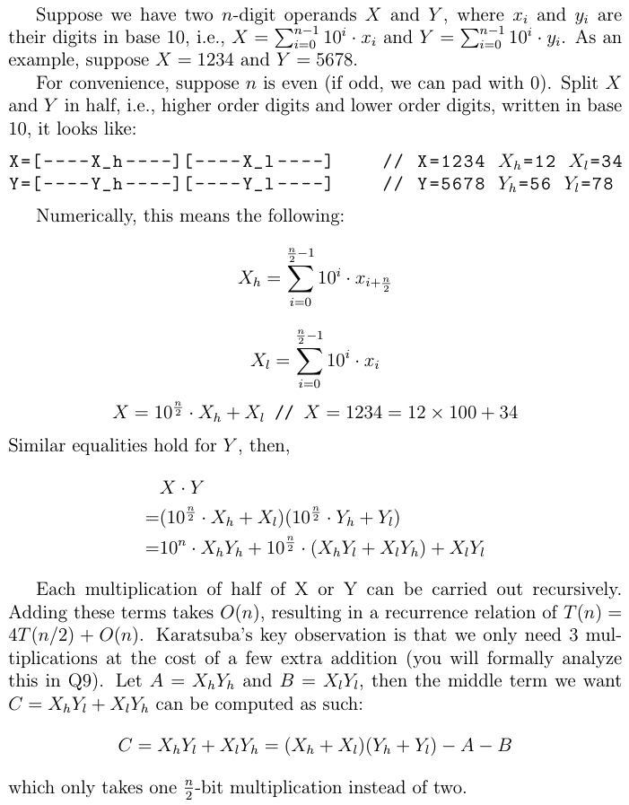

# HW4: Divide and Conquer

The goal of this homework is to practice creating and analyzing divide & conquer algorithms. This assignment is due on **Thursday, February 17, 2022 at 11:59pm**.

### Submitting & Grading
In order to submit this assignment, you must download your code as a ZIP file and upload it to Gradescope. Please include all files.

Your grade on this homework will be out of 27
- Deep Mystery (25 points)
- LeetCode (2 points)
- [Optional] Big Multiplication Extra Credit (5 points)

Note: the autograder will only be used for Q1 and the extra credit questions Q8 & Q9.

### Corrections
If you miss points on this assignment, there will be an opportunity to earn them back by doing homework corrections, so don't worry about the grade if you're having a tough time on some of the questions.

### Academic Integrity
Remember that you can consult outside resources and work with other students as long as you write up your own solutions and cite any links or people you received help from within `citations.txt`.

**This homework requires you to input your TXST ID (begins with an "A") as a string in the `getTxstId` method in `HW4.cpp`.**

## Deep Mystery (25 points total)
Given the pseudocode of `mystery`, answer the following questions.
```
algorithm mystery
  Input: vector of ints vec of size N >= 1,
         integer k between 0 and N-1 inclusive
  Output: ???

  if vec.size() <= 1
    return vec[0]
  pivot = vec[0]
  left = empty vector of ints
  middle = empty vector of ints
  right = empty vector of ints
  for each element el in vec
    if el < pivot
      left.push_back(el)
    else if el = pivot
      middle.push_back(el)
    else
      right.push_back(el)
  if k < left.size()
    return mystery(left, k)
  else if k < left.size() + middle.size()
    return middle[0]
  else
    return mystery(right, k - left.size() - middle.size())
```

**Q1 (3 points).** What are the recursive calls that will be made when calling mystery on your vector and k = 5? Remember to input your TXST ID and hit "Run" (or `g++ -O4 -pthread -std=c++17 HW4.cpp main.cpp -I ../ -o main && ./main`) to get your starting vector. List all the recursive calls within `callsToMystery` in HW4.cpp.

**Q2 (5 points).** What is the best-case runtime of mystery? Define N, provide an example,
and justify your answer. Put your answer in `mystery.txt`.

**Q3 (5 points).** What is the worst-case runtime of mystery? Define N, provide an example,
and justify your answer. Put your answer in `mystery.txt`

**Q4 (5 points).** What is the average-case runtime of mystery? Define N, provide an example, and justify your answer. Put your answer in `mystery.txt`.

**Q5 (5 points).** What is the worst-case space complexity?  Define N and justify your answer. Put
your answer in `mystery.txt`.

**Q6 (2 points).** What does mystery do? Put your answer in `mystery.txt`. Specify the
output as precisely as possible.

## Q7. LeetCode: Binary Search (2 points)

Binary Search (in disguise) or similar D&C algorithms are behind a lot of solutions to different algorithmic challenges. It is simple conceptually, but there are many ways to do it. Everyone has their own style, but our goal here is to hone in on a style you could code from scratch if you encounter a binary search-like challenge.

**Q7.A (1 point)** Solve [Binary Search](https://leetcode.com/problems/binary-search/) in O(log n). After clicking "Submit" and getting status "Accepted", take a screenshot of the entire window (with the time submitted and your code). Attach the complete and successful screenshot as an image named Q7.jpg in your code submissions. There are so many binary search implementations out there, so this is about really mastering it to know you can code it up yourself from scratch. Referencing other solutions is fine, but your final submission should be **fully written, character-by-character, by you, and you should be able to fully explain and reproduce what you did to me in an interview-style setting.** You should also add what you referenced in citations.txt.

**Q7.B (1 point)** For your particular implementation, manually trace what happens each iteration to your left, right, and middle index pointers, for each of these 4 inputs.
```
1. nums = {1, 3, 5}, target = 1
2. nums = {1, 3, 5}, target = 4
3. nums = {1, 3, 5}, target = 0
4. nums = {1, 3, 5}, target = 6
```
These are examples of small inputs you might manually walk the interviewer through to check / debug your logic and convince them that your code works.

Depending on your particular implementation, the answer for 1 might look like the following:
```
1.
l = 0, r = 2, m = 1
l = 0, r = 1, m = 0
```
Put your answer in `Q7.txt`.

**[Optional]** To see how a question might be "binary serach in disguise" and practice extending your solution, solve [Find Minimum in Rotated Sorted Array](https://leetcode.com/problems/find-minimum-in-rotated-sorted-array/). This is great practice. Notes:
- There are a few edge cases to consider here and your code may become more complicated accounting for them. That is okay, as long as you can add comments / explain it. You're encouraged to walk through with simple examples as we did before to help debug (but for this question, possible inputs might be {1, 2, 3}, {3, 1, 2}, {3, 2, 1}, {1, 2}, {2, 1}).
- Depending on the binary search framework you might be extending, there may be more or less edge cases to worry about. [This framework](https://leetcode.com/problems/binary-search/discuss/423162/Binary-Search-101-The-Ultimate-Binary-Search-Handbook) looks to be less error-prone but a little bit more difficult to understand than what might be normally done for vanilla binary search (which is similar to the [top comment](https://leetcode.com/problems/binary-search/discuss/423162/Binary-Search-101/692342)).
- Passing all of LeetCode's test cases for this problem can be challenging. If you got most edge cases in an interview, communicated well, talked through a few examples well, etc your code would not need to work as well as it needs to here to get a "Hire" decision.


## [Optional] Big Multiplication Extra Credit (+5 points total)

**Extra Credit Note:** For the final grade in this course, the average in any one category (e.g. Homeworks) can only be as large as 100% (i.e. if you have a 105%, it will be a 100% for the final grade calculation). But, of course, getting above a 100% on this homework can help future or previous homeworks.

In this question, we explore multiplication of very large numbers. These are calculations on integers whose digits of precision are limited only by the amount of RAM. In contrast, the product of `849324324432415778232344324321432324324324224723890` and an equally long number is not directly computable as the result will overflow (larger than `std::numeric_limits<uint64_t>::max()` i.e. 2^{64} - 1).

To accomplish this, we will represent Integers differently. We start with a `Integer` class in `Integer.h` which contains a vector that stores all the digits in reverse order. For example, the number `123` is represented as `{3, 2, 1}`.

We have provided for you completed member functions for `Integer`:
- the constructor which takes in an `uint64_t`;
- the constructor which takes in an `std::string`;
- the member function `Integer::isValid()` which returns `true` if and only if its vector conforms with our assumptions: (1) there is at least one digit (even `0` has at least one digit); (2) each entry in the vector is a single digit; (3) there are no leading (trailing in the vector) 0's (unless the number represented is `0`).
- the `toString` method for easy printing; if the digits vector is `{3, 2, 1}`, the returned string should be `"123"`.

### Q8. basicMult (+2 points)
Implement `basicMult` which takes in two `Integer`s and returns an `Integer` that represents the product of the two operands. You may use your favorite algorithm from your math class (perhaps from elementary school) as long as the answer is correct. You may not convert the Integer object to an int and do the multiplication (or similar). Though this will work for small numbers / pass some test cases, the autograder points will be deducted during manual grading.

Testing tips: in addition to specific unit tests, you can also consider randomly generate two "smaller" nonnegative ints (e.g. < 10,000), construct the two `Integer` operands from them, `std::to_string(a * b) == basicMult(Integer(a), Integer(b).toString()`. You probably also want to cover cases of larger numbers (e.g. two 50 digit numbers multiplied together). You can get the expected result from www.wolframalpha.com.

Hints:
- During the computation process, you may need to pad the integers, i.e., add leading zeros (trailing zeros in the vector). `vector::resize()` may be a convenient way to do so. However, before your function returns the result, you must clear the leading zeros and return a "valid" `Integer`.
- You may want to write a helper method to handle addition of `Integer` (that may look very similar to HW0's `add`).
- To test, work off the main in `LargeIntegerMultiplication`:
```
g++ -O4 -pthread -std=c++17 Integer.cpp LargeIntegerMultiplication.cpp -I ../ -o LargeIntegerMultiplication && ./LargeIntegerMultiplication
```

### Q9. karatsubaMult (+2 points)
Can we do faster than our basic multiplication? Anatoly Karatsuba, a Russian mathematician, discovered a divide-and-conquer algorithm in 1960 to do exactly that. 




If you prefer a visual / auditory medium to learn the above, you may instead find this [13-minute YouTube video](https://www.youtube.com/watch?v=JCbZayFr9RE) helpful.

Implement `karatsubaMult` with the above algorithm. The autograder points may be deducted if you do not use Karatsuba.

Hints:
- You may want to write a helper method to handle subtraction of `Integer` (in addition to using the addition helper you may have written in Q8).
- Each time you want to do a non-base-case multiplication, be sure to recurse and call `karatsubaMult`.

Suggested testing strategy: in addition to adhoc unittests, you can generate random `Integer`s and compare the results of `basicMult(a,b)` with `karatsubaMult(a,b)`.

### Q10. basicMult vs karatsubaMult (+1 point) 
Provide the runtime of multiplying two large `n`-digit numbers for each of `basicMult` and `karatsubaMult`. For Karatsuba, provide the recurrence relation and use the Master Theorem. Identify which of the two algorithms have a better asymptotic complexity for large `n`.
